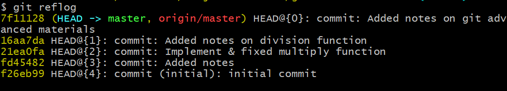
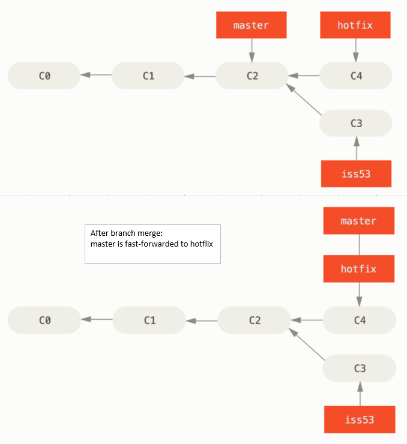
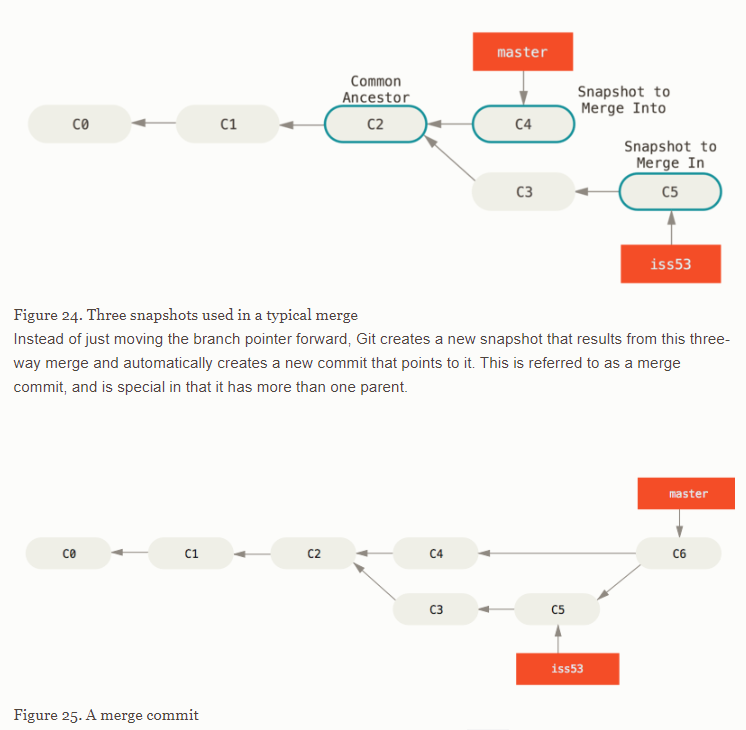
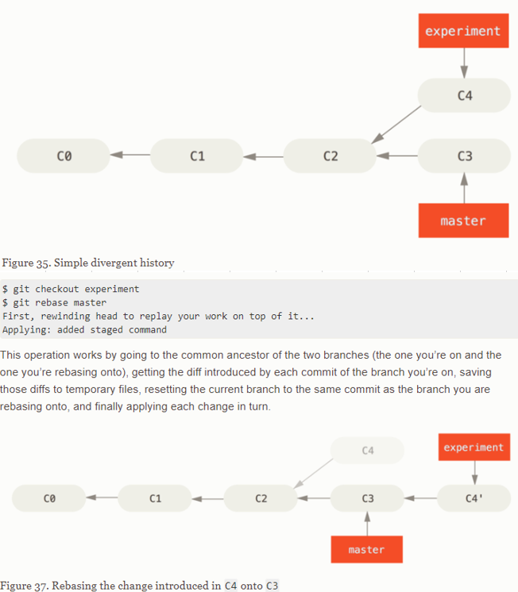

# Git advanced workaround

Git Working Directory:


## Viewing the Commit History
```
$ git log
commit ca82a6dff817ec66f44342007202690a93763949
Author: Scott Chacon <schacon@gee-mail.com>
Date:   Mon Mar 17 21:52:11 2008 -0700

    changed the version number

commit 085bb3bcb608e1e8451d4b2432f8ecbe6306e7e7
Author: Scott Chacon <schacon@gee-mail.com>
Date:   Sat Mar 15 16:40:33 2008 -0700

    removed unnecessary test

commit a11bef06a3f659402fe7563abf99ad00de2209e6
Author: Scott Chacon <schacon@gee-mail.com>
Date:   Sat Mar 15 10:31:28 2008 -0700

    first commit
```

```
$ git log --stat
commit ca82a6dff817ec66f44342007202690a93763949
Author: Scott Chacon <schacon@gee-mail.com>
Date:   Mon Mar 17 21:52:11 2008 -0700

    changed the version number

 Rakefile | 2 +-
 1 file changed, 1 insertion(+), 1 deletion(-)

commit 085bb3bcb608e1e8451d4b2432f8ecbe6306e7e7
Author: Scott Chacon <schacon@gee-mail.com>
Date:   Sat Mar 15 16:40:33 2008 -0700

    removed unnecessary test

 lib/simplegit.rb | 5 -----
 1 file changed, 5 deletions(-)

commit a11bef06a3f659402fe7563abf99ad00de2209e6
Author: Scott Chacon <schacon@gee-mail.com>
Date:   Sat Mar 15 10:31:28 2008 -0700

    first commit

 README           |  6 ++++++
 Rakefile         | 23 +++++++++++++++++++++++
 lib/simplegit.rb | 25 +++++++++++++++++++++++++
 3 files changed, 54 insertions(+)
```
## Working with Remotes
### git clone
```
$ git clone https://github.com/schacon/ticgit
Cloning into 'ticgit'...
remote: Reusing existing pack: 1857, done.
remote: Total 1857 (delta 0), reused 0 (delta 0)
Receiving objects: 100% (1857/1857), 374.35 KiB | 268.00 KiB/s, done.
Resolving deltas: 100% (772/772), done.
Checking connectivity... done.
$ cd ticgit
$ git remote
origin
```
### Show remote repository
```
$ git remote -v
origin	https://github.com/schacon/ticgit (fetch)
origin	https://github.com/schacon/ticgit (push)
```
### Adding Remote Repositories
```
$ git remote
origin
$ git remote add pb https://github.com/paulboone/ticgit
$ git remote -v
origin	https://github.com/schacon/ticgit (fetch)
origin	https://github.com/schacon/ticgit (push)
pb	https://github.com/paulboone/ticgit (fetch)
pb	https://github.com/paulboone/ticgit (push)
```
### Pushing to Your Remotes
```
$ git push origin master
```

## git diff
- Provide comparison between working directory vs staging area <br>
```git diff```

- Provide comparison between two SHA's <br>
```git diff ${SHA-1 code-1} ${SHA-1 code-2} ```

## Git stash
Keep temporary stuffs in the bin (behaves like stack)
```
git stash list
git stash apply ${stash@{0}}      // Applying stash
git stash drop ${stash@{0}}       // Remove manually
git stash pop         // Apply & drop topmost stash element
git stash - u         // stash including untracked files
git stash save "some comments"
git stash -u save "some comments"

```

## Git reset
Most common git reset as follows
- soft as option with reset command
- mixed (default), no option with reset command
- hard as option with reset command

Git Commit history:


- Step 1: Move HEAD

result: HEAD move back. However, files remain in the staging area.
In order to undo we need to execute ```git checkout .``` command

- Step 2: Updating the Index (--mixed)

result: HEAD move back. However, files remain in the working/staging area depending on previous activites. In order to undo we need to execute ```git checkout . && git clean -df``` command

- Step 3: Updating the Working Directory (--hard)

result: HEAD move back as well as files come back to working area. In order to undo we need to execute ```git clean -df``` command


**Summary of Git Reset**:

Command format | HEAD	| Index	| Workdir	| WD Safe?
-------|----- |-------|---------|---------
reset --soft [commit] | REF | NO | NO | YES
reset [commit] | REF | YES | NO | YES
reset --hard [commit] | REF | YES | YES | NO

Reference:
[Git Reset Demystified](https://git-scm.com/book/en/v2/Git-Tools-Reset-Demystified)


## Commom mistakes & rollback

### Unmodifying a Modified File
- Files tracking condition
```
git checkout ${fileName}    // for specific file
git checkout .              // all files in the current directory
```
- Unstaging a Staged File
```
git reset ${filename}
```
- Deleting from working area
```
git clean -df             // -d for directory, -f for files
```

### Amend some works
Add some changes to previous commit or change the commint messages
```
git commit --amend -m "new commit msg"
```
**Notes: change SHA-1 code means change git commit history. It could harmful for shared/public repository**

### Move back commit to relevent branch

Describe the scenario:<br>
Master branch SHA-1 code (f30ab --> 34ac2 --> 98ca9) <br>
Feature branch SHA-1 code (         34ac2 --> 87ab2)<br>
Developer made a commit in Feature branch (87ab2). However, he needs to bring it back to master branch.

Workaround:
- git cherry-pick in the master branch (bring the commint to master branch)
- git reset to bring HEAD pointer back to previous working stage (means delete the commit)

```
git checkout ${feature}
git log         // Copy the SHA-1 code
git checkout master
git cherry-pick ${SHA-1 Code}     // Let's say, 87ab2
git checkout ${feature}
git reset ${target SHA-1 code}
git checkout . or
git clean -df           // Depending on git status
```

### Move back commit in public/share repository
git revert provides this flexibility. It performs the job by adding
a new commit (SHA-1 code) which makes to keep track of other
people's git history
```
git revert ${SHA-1 code}
```

### Move back to deleted files (by git reset --hard)
There is a chance to recover deleted files which are once part of commit (SHA-1 code) depending on Git's garbage collection strategy.<br>
Git reflog


Workaround :
```
git reflog            // Copy the target SHA-1 code, Let's say, 1b818d3
git checkout ${SHA-1 code}
git log               // Check whether commit (SHA-1 code) back or not
/* This is detached HEAD state meaning this will trash out at some point*/
git branch test       // This branch clones previous state
git checkout master
git merge test        // Merge & bring it back to master
```
## Git Branching
### Basic Merge



### Recursive Merge



### Git Rebase

